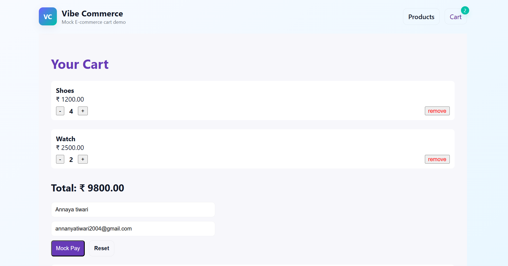
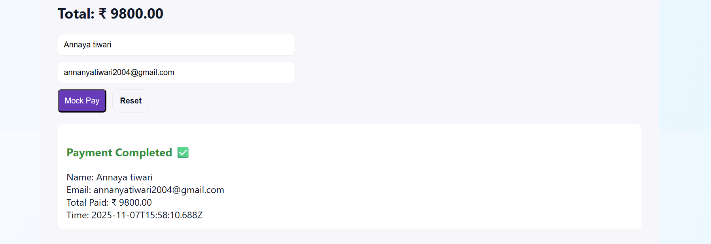

VibeCommerce - Mock E-Commerce Cart App

This is a full stack assignment project for Vibe Commerce screening.
A basic shopping cart application with Products, Cart, Qty Update, Remove, and Mock Checkout Receipt.

Tech Used
Part	                Tech
Frontend	            React
Backend          	Node + Express
Database	            SQLite
Bonus Included	  DB persistence, Error Handling, Fake Store API Integration

Features-

1)Products List Grid
2)Add to Cart
3)Remove items from Cart
4)Update quantity (+ / -)
5)Checkout with name & email
6)Receipt with total + timestamp
7)Data is stored in DB (persists)
8)Error handling implemented
9)Fake Store API used to enrich product data

Folder Structure-
/backend
/frontend

Setup Instructions-
Backend Setup-
cd backend
npm install
node server.js

Backend runs at: http://localhost:5000

Frontend Setup-
cd frontend
npm install
npm start

Frontend runs at: http://localhost:3000

API Endpoints-
Method	                     Route	                                  Description
GET	                       /api/products	                          List products
POST	                     /api/cart	                              Add item to cart
DELETE	                   /api/cart/:id	                            Remove item
PATCH	                     /api/cart-update	                       Update quantity
GET	                       /api/cart	                             Cart items + total
POST	                     /api/checkout	                         Mock checkout receipt

Screenshots-

 Products Page

 Cart Page

 Checkout Receipt

Demo Video-
